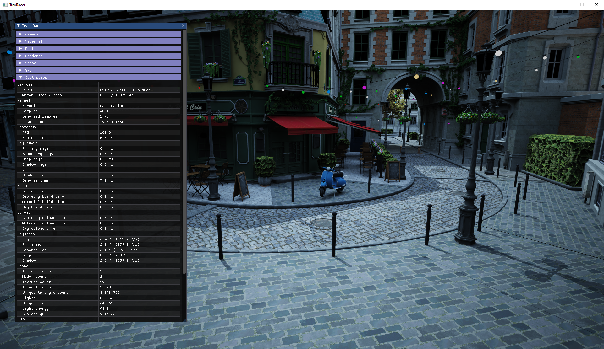

# TrayRacer

TrayRacer is a physically based rendering framework developed as a spare time hobby/research project. It uses wavefront ray tracing to reach high ray throughput on RTX hardware using NVIDIA OptiX.

# Controls

## GUI
| GUI window | Key |
|----|----|
| Main | F1 |

## Camera
| Action | Key | Alt Key |
|----|----|----|
| Dolly | Right Mouse Button | Scroll Wheel |
| Move | Middle Mouse Button ||
| Orbit | Left Mouse Button ||
| Roll | ALT + Right Mouse Button ||
| Rotate | ALT + Left Mouse Button ||

## Picker
| Action | Key |
|----|----|
| Set focal distance | F + Left Mouse Button |
| Set camera target | T + Left Mouse Button |
| Select material | M + Left Mouse Button |

# Dependencies

* [CUDA Toolkit 11.8](https://developer.nvidia.com/cuda-11-8-0-download-archive)
* [Windows 10.0 SDK](https://developer.microsoft.com/en-us/windows/downloads/windows-10-sdk/)

# Resources

* [appleseed](https://github.com/appleseedhq/appleseed)
* [Lighthouse2](https://github.com/jbikker/lighthouse2)
* [OptiX 7 Course](https://github.com/ingowald/optix7course)
* [PBRT](https://www.pbrt.org/)

# Third party libraries

* [Assimp](https://www.assimp.org/)
* [CUDA](https://developer.nvidia.com/cuda-toolkit)
* [FreeImage](http://freeimage.sourceforge.net/)
* [GLFW](https://www.glfw.org/)
* [ImGUI](https://github.com/ocornut/imgui)
* [imGuIZMO](https://github.com/BrutPitt/imGuIZMO.quat)
* [Magic Enum](https://github.com/Neargye/magic_enum)
* [OpenGL](https://www.opengl.org/)
* [OptiX](https://developer.nvidia.com/optix)
* [RapidJSON](https://rapidjson.org/)
